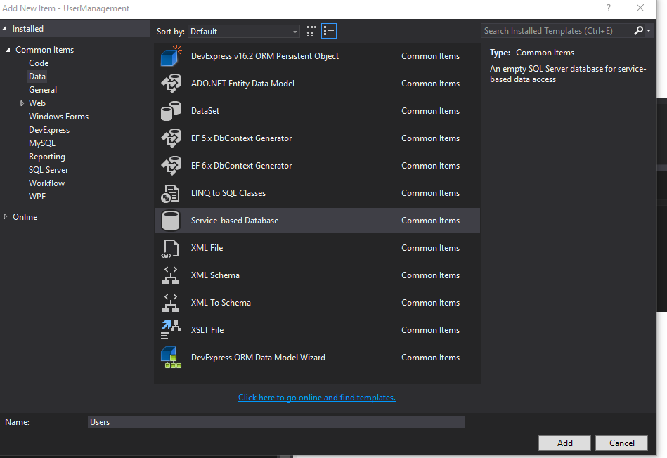
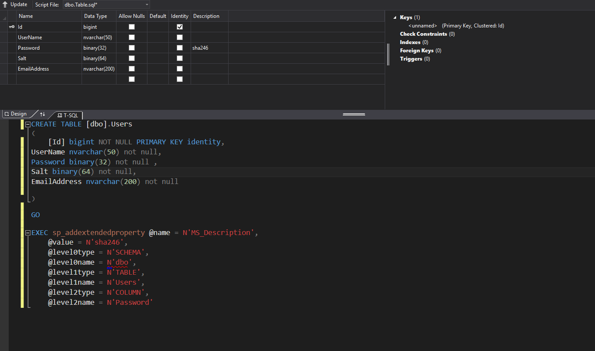

# User Management Using Entity Framework

1.  Setup Data
    1.  Add database 
    2.  Add user Table 
    3.  Add Entity Framework Model  
    	1.  Add EF Model
    	2.  Select Model Type
    	3.  Select DB objects to include in model
    4.  Build Project (Ctrl+Shift+B)
    
2. GUI
   1. Add datasource
    	1.  
    	2.  
    	3.     
   2. Drag datasource to form
   3. Dock grid in form
   4. Edit columns to make grid have desired columns and properties
3. Code
   1.  Alter User class to provide defaults when instane is created
   2.  Build Project (Ctrl+Shift+B)
   3.  Delete all tables in project db
   4.  Set users.mdf Copy to Output Directory property to Copy if newer
   5.  Delete Users.mdf and Users.ldf in bin/debug
   6.  Open Package Manager Console 
   3.  Run Enable-Migrations
   5.  Run Add-Migration "Add User table"
   6.  Run update-database
   7.  Code form functionality
   8.  Repeat 5 and 6 each time you alter your code first classes.  If you add another DBContext you will need to adjust the update-database command. It will tell you what you need to do. 

